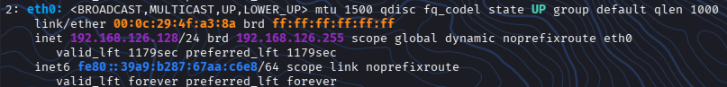
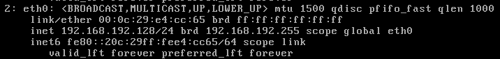

# 01. Reconocimiento de Red con Nmap

**Nivel:** 1 - Sencillo  
**Entorno:** VMware Lab  
**Máquina Atacante:** Kali Linux  
**Máquina Objetivo:** Metasploitable 2  
**IP Objetivo:** `192.168.192.128`  

---

## 🎯 Objetivos
- Descubrir la IP de la máquina objetivo en el segmento de red local.
- Realizar un escaneo de puertos completo para mapear la superficie de ataque.
- Identificar versiones de software y scripts básico de auditoría (NSE).

---

## 🛠️ Preparación del Lab

Primeramente necesitaremos conocer las direcciones IP de nuestras VMs, tanto de la VM víctima como la del atacante.

Para poder identificar las IP´s haremos lo siguiente:

# 1. Entramos en la VM de Kali y ejecutamos el siguiente comando:

´´´
ip a
´´´

- Este nos mostrara de forma rápida y detallada la configuración de todas las redes y direcciones IP asignadas a las interfaces del equipo.

### Resultado

En este caso lla eth0 es la del adaptador Host-Only y tiene la siguiente dirección IP: **192.168.192.129/24**

# 2. Continuamos con el mismo proceso, pero en la VM de Metasploitable2

´´´
ip a
´´´

### Resultado

También esta en el adaptador Host-Only lo cual es importante de cumplir, y tiene la siguiente dirección IP: **192.168.192.128/24**

Teniendo esta información ya podemos continuar con los ejercicios

  

## Descubrimiento de Hosts

Para realizar un descubrimiento de Hosts en la red local realizamos lo siguiente:

´´´
sudo netdiscover -r 192.168.192.128/24

O también utilizando Nmap:

sudo nmap -sn 192.168.192.128/24
´´´

  

## Escaneo Rápido de los principales Puertos TCP

Realizar un escaneo de los puertos TCP es una buena manera de saber que servicios TCP estan abiertos, lo cual nos da una buena idea de como proceder

´´´
sudo nmap -sS -F 192.168.192.128
´´´

### Resultado

Podemos apreciar un total de 18 de los principales puertos TCP abiertos

  

## Escaneo Completo con Detección de Servicios y Versiones

Hacer un escaneo completo es muy útil porque esto nos da muchisima información muy valiosa a la hora de seguir con una posterior explotación

Escanearemos los 65,5355 puertos TCP, detectando versiones de servicios, además de identificar el Sistema Operativo

´´´
sudo nmap -sCV -p- 192.168.192.128 -oA scan_metasploitable
´´´

#### Modificadores Utilizados

* -sC: ejecuta scripts por defecto de Nmap NSE
* -sV: detecta las versiones de los servicios
* -p-: escanea todos los puertos
* -oA scan_metasploitable: guarda los resultados en 3 formatos (.nmap, .gnmap, .xml)

### Resultado

´´´
Not shown: 65506 closed tcp ports (reset)
PORT      STATE SERVICE     VERSION
21/tcp    open  ftp         vsftpd 2.3.4
|_ftp-anon: Anonymous FTP login allowed (FTP code 230)
| ftp-syst: 
|   STAT: 
| FTP server status:
|      Connected to 192.168.192.129
|      Logged in as ftp
|      TYPE: ASCII
|      No session bandwidth limit
|      Session timeout in seconds is 300
|      Control connection is plain text
|      Data connections will be plain text
|      vsFTPd 2.3.4 - secure, fast, stable
|_End of status
22/tcp    open  ssh         OpenSSH 4.7p1 Debian 8ubuntu1 (protocol 2.0)
| ssh-hostkey: 
|   1024 60:0f:cf:e1:c0:5f:6a:74:d6:90:24:fa:c4:d5:6c:cd (DSA)
|_  2048 56:56:24:0f:21:1d:de:a7:2b:ae:61:b1:24:3d:e8:f3 (RSA)
23/tcp    open  telnet      Linux telnetd
25/tcp    open  smtp        Postfix smtpd
|_smtp-commands: metasploitable.localdomain, PIPELINING, SIZE 10240000, VRFY, ETRN, STARTTLS, ENHANCEDSTATUSCODES, 8BITMIME, DSN
53/tcp    open  domain      ISC BIND 9.4.2
| dns-nsid: 
|_  bind.version: 9.4.2
80/tcp    open  http        Apache httpd 2.2.8 ((Ubuntu) DAV/2)
|_http-server-header: Apache/2.2.8 (Ubuntu) DAV/2
|_http-title: Metasploitable2 - Linux
111/tcp   open  rpcbind     2 (RPC #100000)
| rpcinfo: 
|   program version    port/proto  service
|   100000  2            111/tcp   rpcbind
|   100000  2            111/udp   rpcbind
|   100003  2,3,4       2049/tcp   nfs
|   100003  2,3,4       2049/udp   nfs
|   100005  1,2,3      54051/tcp   mountd
|   100005  1,2,3      58897/udp   mountd
|   100021  1,3,4      42354/udp   nlockmgr
|   100021  1,3,4      45914/tcp   nlockmgr
|   100024  1          33180/tcp   status
|_  100024  1          34202/udp   status
139/tcp   open  netbios-ssn Samba smbd 3.X - 4.X (workgroup: WORKGROUP)
445/tcp   open  netbios-ssn Samba smbd 3.0.20-Debian (workgroup: WORKGROUP)
512/tcp   open  exec        netkit-rsh rexecd
513/tcp   open  login?
514/tcp   open  shell       Netkit rshd
1099/tcp  open  java-rmi    GNU Classpath grmiregistry
1524/tcp  open  bindshell   Metasploitable root shell
2049/tcp  open  nfs         2-4 (RPC #100003)
2121/tcp  open  ftp         ProFTPD 1.3.1
3306/tcp  open  mysql       MySQL 5.0.51a-3ubuntu5
| mysql-info: 
|   Protocol: 10
|   Version: 5.0.51a-3ubuntu5
|   Thread ID: 8
|   Capabilities flags: 43564
|   Some Capabilities: Support41Auth, LongColumnFlag, SupportsTransactions, ConnectWithDatabase, Speaks41ProtocolNew, SwitchToSSLAfterHandshake, SupportsCompression
|   Status: Autocommit
|_  Salt: FZoA4!G$|gnqoZTsi6oN
3632/tcp  open  distccd     distccd v1 ((GNU) 4.2.4 (Ubuntu 4.2.4-1ubuntu4))
5432/tcp  open  postgresql  PostgreSQL DB 8.3.0 - 8.3.7
| ssl-cert: Subject: commonName=ubuntu804-base.localdomain/organizationName=OCOSA/stateOrProvinceName=There is no such thing outside US/countryName=XX
| Not valid before: 2010-03-17T14:07:45
|_Not valid after:  2010-04-16T14:07:45
|_ssl-date: 2026-08-05T02:35:43+00:00; +14s from scanner time.
5900/tcp  open  vnc         VNC (protocol 3.3)
| vnc-info: 
|   Protocol version: 3.3
|   Security types: 
|_    VNC Authentication (2)
6000/tcp  open  X11         (access denied)
6667/tcp  open  irc         UnrealIRCd
6697/tcp  open  irc         UnrealIRCd
8180/tcp  open  http        Apache Tomcat/Coyote JSP engine 1.1
|_http-favicon: Apache Tomcat
|_http-title: Apache Tomcat/5.5
8787/tcp  open  drb         Ruby DRb RMI (Ruby 1.8; path /usr/lib/ruby/1.8/drb)
33180/tcp open  status      1 (RPC # 100024)
45914/tcp open  nlockmgr    1-4 (RPC # 100021)
54051/tcp open  mountd      1-3 (RPC # 100005)
59241/tcp open  java-rmi    GNU Classpath grmiregistry
MAC Address: 00:0C:29:E4:CC:65 (VMware)
Service Info: Hosts:  metasploitable.localdomain, irc.Metasploitable.LAN; OSs: Unix, Linux; CPE: cpe:/o:linux:linux_kernel

Host script results:
| smb-os-discovery: 
|   OS: Unix (Samba 3.0.20-Debian)
|   Computer name: metasploitable
|   NetBIOS computer name: 
|   Domain name: localdomain
|   FQDN: metasploitable.localdomain
|_  System time: 2026-08-04T22:34:29-04:00
|_nbstat: NetBIOS name: METASPLOITABLE, NetBIOS user: <unknown>, NetBIOS MAC: <unknown> (unknown)
|_clock-skew: mean: 1h20m14s, deviation: 2h18m34s, median: 14s
|_smb2-time: Protocol negotiation failed (SMB2)
| smb-security-mode: 
|   account_used: <blank>
|   authentication_level: user
|   challenge_response: supported
|_  message_signing: disabled (dangerous, but default)

Service detection performed. Please report any incorrect results at https://nmap.org/submit/ .
Nmap done: 1 IP address (1 host up) scanned in 257.47 seconds
´´´

  

## Lecciones Aprendidas

* El parámetro **-p-** es fundamental para no omitir servicios expuestos en puertos no estándar
* El uso de **-oA** permite almacenar evidencias en formatos analizables para posteriores reportes e informes
* Metasploitable2 expone una gran variedad de servicios obsoletos y vulnerables por diseño

