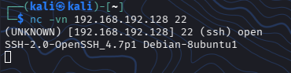
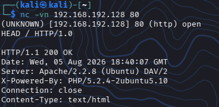
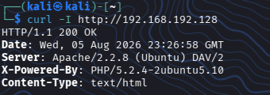

## 02. Banner Grabbing

### Características

**Nivel:** 1 - Sencillo

**Entorno:** VMware Lab

**Maquina Atacante:** Kali Linux

**Máquina Objetivo:** Metasploitable 2

**IP Objetivo:** `192.168.192.128`

---

## 🎯 Objetivos
- Obtener la marca y versión de los servicios expuestos sin ejecutar escaneos agresivos.
- Utilizar herramientas fundamentales como Netcat, Curl y scripts de Nmap.
- Comparar las respuestas obtenidas entre cada herramienta.


---

## Banner Grabbing 

Esta es una técnica de reconocimiento pasivo/semipasivo que consiste en conectarse a un puerto abierto para leer el **banner** o mensaje de bienvenida que emite el servicio


Esto nos permitirá conocer la versión exacta del software

---


## 🛠️ Ejecutaremos Banner Grabbing con distintas herramientas

Abriremos la terminal de Kali Linux y probaremos estas tres técnicas complementarias:


### 1. Banner Grabbing manual con Netcat(nc)

Netcat nos permitirá abrir una conexión TCP pura y leer la respuesta directa del servicio


Como sabemos que hay muchos puertos TCP abiertos, haremos lo siguiente:


#### Para FTP(Puerto 21):

```
nc -vn 192.168.192.128 21
```


Claramente podemos ver la respuesta del servidor FTP antes de ingresar comandos

Pero... ¿Esto que quiere decir exactamente?

Bueno, significa que hemos conectado con éxito al servidor FTP de Metasploitable2 y que este respondió con su banner de bienvenida


Te parece si desglozamos un poco el resultado y de esa manera entendemos mejor:

* **open**: confirma que el puerto 21 está abierto, activo y aceptando conexiones desde nuestra VM atacante Kali

* **220**: este es el código estandar del protocolo FTP que significa **Servicio listo para nuevo usuario**

* **vsFTPd 2.3.4**: este es el dato más importante, ya que nos revela el nombre del software (vsFTPd) y su versión exacta (2.3.4)


#### Para el Puerto SSH(Puerto 22)

```
nc -vn 192.168.192.128 22
```


El servidor SSH responderá enviando una versión exacta del protocolo y del software


Al igual que en el comando y resultado anterior, este resulta en una conexión exitosa mediante **Banner Grabbing**, pero ahora contra el servicio de administración remota SSH (Secure Shell) en el puerto 22

Realizemos un desgloce para su mejor comprensión:

* **(ssh) open**: Nos confirma que el puerto 22 esta abierto en Metasploitable2 y listo para recibir conexiones cifradas

* **SSH-2.0**: Indica la version del protocolo de comunicación que se esta utilizando(en este caso, la versión 2.0, la cual es el actual estandar)

* **OpenSSH_4.7p1**: Este es el nombre del software y su exacta versión. Nos dice que esta usando una versión antigua de OpenSSH

* **Debian-8Ubuntu1**: Nos revelo satisfactoriamente el sistema operativo base de la maquina objetivo


#### Para el Puerto HTTP/Servidor Web(Puerto 80)

```
nc -vn 192.168.192.128 80
```



A diferencia de los puertos anteriores, el protocolo HTTP no envía información de inmediato

Es por esto que luego de escribir el comando debemos escribir **HEAD / HTTP/1.0** y presionar Enter dos veces


De esta manera obligamos al servidor a entregarnos sus **cabeceras** (headers) de respuesta sin descargar toda la pagina web


Desglocemos el resultado:

* **(http) open**: El servidor nos dice que esta encendido y escuchando peticiones

* **HTTP/1.1 200 OK**: Este es el código de estado web que significa que la petición fue exitosa y el servidor funciona correctamente

* **Server: Apache/2.2.8 (Ubuntu) DAV/2**: Nos revela el software del servidor web (Apache), su versión exacta, ademas nos confirma nuevamente que el sistema operativo es Ubuntu

* **X-Powered-By: PHP/5.2.4-2ubuntu5.10**: Nos dice que la pagina web ejecuta código PHP y da la versión exacta


### 2. Banner Grabbing Web con Curl(curl)

Para los servicios HTTP/HTTPS, **curl** nos permite inspeccionar los encabezados **headers** de respuesta de forma rápida mediante el argumento **-l** (o --head)

```
curl -l http://192.168.192.128
```



En el resultado que arroja el comando, podemos ver la cabecera **Server** y sus tecnologías adicionales como **PHP**


## 📚 Lecciones Aprendidas y Remediación


* Riesgo: El **Banner Disclosure** facilita al atacante la busqueda exacta de exploits en base de datos como Searchsploit o Exploit-DB

* Remediacion (Hardening):+

   ◇ Ocultar cabeceras en servidores web (SeverSignature Off y ServerTokens Prod en Apache)

   ◇ Configurar las opciones del servicio FTP/SSH para no mostrar versiones detalladas en el mensaje de bienvenida