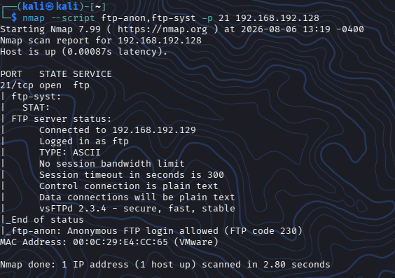
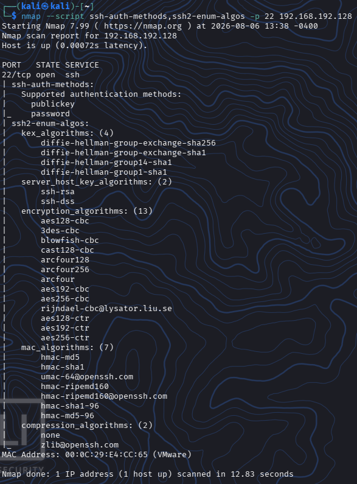
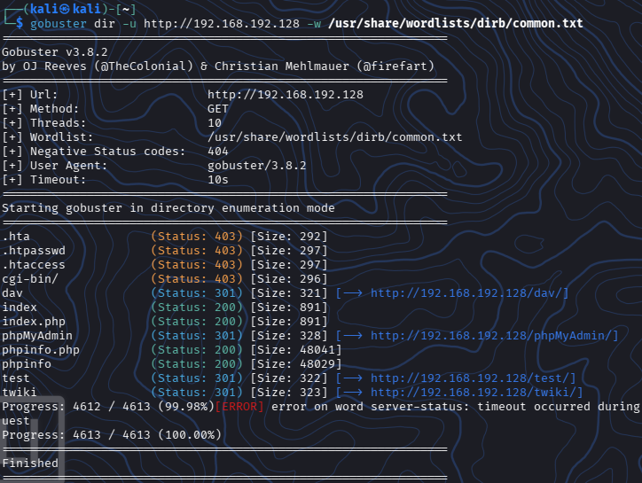
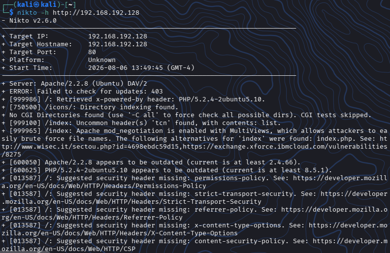
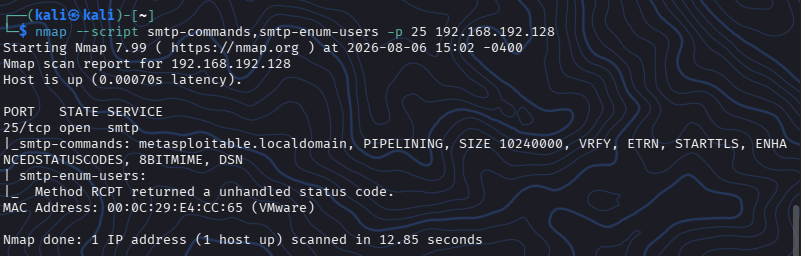
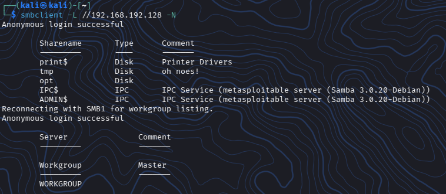
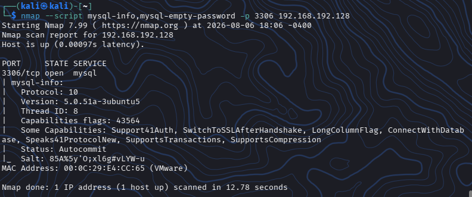

## 03. Enumeracióm de Servicios (FTP, SSH, HTTP, SMTP, SMB, MySQL)

### Características

**Nivel:** 1 - Sencillo

**Entorno:** VMware Lab

**Máquina Atacante:** Kali Linux

**Máquina Objetivo:** Metasploitable2

**IP Objetivo:** `192.168.192.128`

---

## 🎯 Objetivos

- Extraer información detallada y configuraciones de cada uno de los servicios críticos expuestos
- Identificar usuarios del sistema, rutas web ocultas, recursos compartidos y accesos anónimos o por defecto


---

## Enumeración de Servicios (FTP, SSH, HTTP, SMTP, SMB, MySQL)

En este proyecto profundizaremos en cada protocolo expuesto por **Metasploitable2**

Mientras que en los proyectos 01 y 02 solo vimos que puertos estaban abiertos y que banners respondian, en la **Enumeración** buscamos información operativa relevante:

- cuentas de usuario
- recursos compartidos
- estructuras de directorios
- accesos anónimos

---


## 1. Enumeracion de FTP(Puerto 21)

Comprobaremos si permite acceso anónimo **anonymous** y que comandos admite

```
# Probar inicio de sesion anónimo con Nmap

nmap --script ftp-anon,ftp-syst -p 21 102.168.192.128
```

+


Si **ftp-anon** indica **Anonymous FTP login allowed**, significa que podemos ingresar usando usuario **anonymous** y cualquier contraseña


### ¿Te parece si vemos que nos dice el resultado?

```

|_ftp-anon: Anonymous FTP login allowed (FTP code 230): Este hallazgo es algo crítico. El script de Nmap confirma que el servidor tiene una falla de configuración grave al poder permitir el ingreso de anónimos


vsFTPd 2.3.4 - secure, fast, stable: El script **ftp-syst** extrajo de forma interna el estado del software. Nos reafirma que la versión exacta es la **2.3.4**


Connected to 192.168.192.128: Aquí el reporte de Nmap nos muestra que el servidor FTP de Metasploitable2 registró una conexión exitosa con la interfaz dde Kali
```


## 2. Enumeración de SSH(Puerto 22)

Identificaremos los métodos de autenticación soportados y algoritmos aceptados

```
nmap --script ssh-auth.methods,ssh2-enum-algos -p 22 192.168.192.128
```




Aquí podemos ver que la sesión SSH claramente carece de configuraciones modernas de endurecimiento (hardening)

Es completamente susceptiblle a ataques de intercepción **Man-in-the-Middle**


Por ejemplo, métodos como **password** habilitados y cifrados obsoletos o débiles


## 3. Enumeración de HTTP(Puerto 80) Usando Gobuster

Ahora descubriremos páginas ocultas, rutas de administración y ejecutaremos un análisis web clásico


### Descubramos directorios ocultos

```
gobuster dir -u http://192.168.192.128 -w /usr/share/wordlists/dirb/common.txt
```




### Veamos que encontramos

Vemos claramente una exposición de información crítica:

```

/phpinfo.php: Esta ruta responde con un estado 200 OK. Expone toda la configuración interna de PHP, variables de entorno, módulos cargados y rutas absolutas del sistema


/phpMyAdmin: Esta es la interfaz de gestión de la DB de MySQL. Al estar accesible, abre la puerta de ataques de elusión o inyección de código


/dav: Confirmamos la presencia activa **WebDAV** (detectado previamente en el banner).
Nos permite la interacción con archivos mediante HTTP


/twiki: Este es una software de colaboración wiki basado en Perl. Las versiones antiguas de TWiki suelen ser vulnerables


.htaccess: Nos devuelve un código 403 Forbidden, lo que nos valida que el archivo de configuración del servidor web existe y bloquea el acceso directo
```


## 3. Enumeración de HTTP(Puerto 80) Usando Nitko

Ahora realizaremos un escaneo de vulnerabilidades automatizado con **Nitko** centrado en la configuración del servidor web Apache y las cabeceras HTTP

```

# Realizemos un escaneo de vulnerabilidades web básico con Nitko

nitko -h http://192.168.192.128
```




### ¿Qué encontramos?

* Software Obsoleto (Apache/2.2.8 y PHP/5.2.4): Indica que el servidor web utiliza versiones antiguas con múltiples fallas públicas de ejecución de comandos.

* Fuerza Bruta de Archivos (mod_negotiation / MultiViews): Esta función del servidor ayuda a un atacante a adivinar nombres de archivos ocultos mediante variaciones en las peticiones.

* Ataque XST Activo (HTTP TRACE method): Permite el robo de cookies de sesión protegidas mediante la duplicación de peticiones HTTP en el navegador.

* Filtración de Datos (phpinfo.php y PHP Easter Eggs): Expone la configuración interna del servidor, rutas del sistema y variables de entorno a cualquier usuario.

* Carpetas Expuestas (/doc/ browsable): Permite listar y navegar manualmente por los archivos del servidor porque el indexado de directorios está activo.

* Falta de Cabeceras de Seguridad: El sitio no protege a los usuarios contra ataques comunes como robo de clics (Clickjacking) o inyección de scripts (XSS).


## 4. Enumeración de SMTP(Puerto 25)

Ahora vamos a realizar una comprobación para ver si el servidor permite enumerar usuarios válidos del sistema operativo mediante comandos **VRFY**

```
nmap --script smtp-commands,smtp-enum-users -p 25 192.168.192.128
```



Si vemos que el servidor responde afirmativamente al comando **VRFY**, Nmap confirmará que usuarios existen en la máquina

Esto claramente representa una fuga de información crítica


### ¿Qué encontramos?

* smtp-commands: El servidor expone explicitamente el comando **VRFY**. Esto nos connfirma que un atacante puede verificar manualmente la existencia de usuarios reales en el sistema operativo

* smtp-enum-users: El script arrojo un error (Method RCPT returned a unhandled status code)

Esto ocurre porque ell servidor SMTP de Metasploitable2 respondio con un codigo de estado inesperado frente a las solicitudes automatizadas en bloque


A pesar del fallo del script automatizado de Nmap, la presencia confirmada de **VRFY** en las cabeceras significa que la enumeración de usuarios sigue siendo viable de forma manual o tambien utilizando herramientas alternativas


## 5. Enumeración de SMB(Puertos 139 / 445)

SMB (Server Message Block) suele ser una de las mayores fuentes de información en auditorías Linux/Windows

En esta ocasión extraeremos recursos compartidos y usuarios del sistema:


### Comencemos por Listar recursos compartídos

```
smbclient -L //192.168.192.128 -N
```

Este comando intenta comprobar si el servidor sufre de alguna falla de control de acceso por permitir que cualquiér usuario anónimo de la red husmeé el árbol de recursos


Si nuestro comando tiene éxito, nos mostrará un listado de nombres de las carpetas compartidas


### Pero bueno, primero antes de seguir entendamos que hace nuestro comando:

* smbclient: Esta es una herramienta nativa de Linux diseñada para poder interactuar con recursos compartidos de redes SMB/CIFS, podriamos decir que funciona de forma similar a un cliente FTP

* -L //192.168.192.192.128: Con esto le ordenaremos a la herramienta que liste (-L) todos los recursos que tiene disponibles el servidor objetivo

* -N: Aplicamos la bandera **No-pass**, lo cual obliga a la herramienta a intentar la conexion saltandose la peticion de contraseña





### 🔎 Haber que encontramos

**Anonymous login successful**: El servidor nos permite el acceso sin autenticación

**tmp, opt**: Pudimos identificar directorios del sistema accesibles de forma anónima


El banner nos confirma el uso de **Samba 3.0.20-Debian**

Esta versión específica posee una vulnerabilidad crítica muy conocida de ejecución remota de comandos (RCE)


### Sigamos con la Enumeración automatizada completa de SMB

```

# Enumeración autromatizada completa de SMB

enum4linux -a 192.168.192.128
```


### 🔎 Haber... momento.. hay que entender que haremos cierto?

* enum4linux: Esta es una herramienta escrita en Perl diseñada específicamente para enumerar información de sistemas Windows y Linux con Samba a través de peticiones SMB


* -a: Activamos el modo de enumeración completa

```
[+] Got domain/workgroup name: WORKGROUP
[+] Server 192.168.192.128 allows sessions using username '', password ''
[+] Got OS info: metasploitable server (Samba 3.0.20-Debian)

[+] Enumerated Users via RID Cycling:
Account: root        RID: 0x3e8  Desc: Superusuario / Administrador
Account: msfadmin    RID: 0xbb8  Desc: Cuenta de servicio por defecto
Account: user        RID: 0xbba  Desc: Usuario común del sistema
Account: www-data    RID: 0x42a  Desc: Cuenta del servidor web Apache
Account: postgres    RID: 0x4c0  Desc: Administrador de Base de Datos
Account: tomcat55    RID: 0x4c4  Desc: Servicio Apache Tomcat
```

Podemos apreciar una fuga crítica de nombres de usuarios
Esto ha expuesto una lista de 35 cuentas legítimas del sistema operativo, eliminando la necesidad de que un atacante tenga que adivinar o realizar ataques de fuerza bruta aleatorios para descubrirlos


De igual forma, cuentas claves como **root**, **msfadmin** y **user** quedan completamente expuestas


## 6. Enumeración de MySQL(Puerto 3306)

Verificaremos si la DB permite conexiones remotas e intentaremos con credenciales por defecto **root sin contraseña**

```
nmap --script mysql-info,mysql-empty-password -p 3306 192.168.192.128
```

### 🔎 Esta muy interesante hasta ahora pero antes veamos que nos dice el comando anterior

* --script mysql-info,mysql-empty-password: Activamos dos scripts especializados del motor NSE:

   ◇ mysql-info: Nos conecta al servidor para extraer informacion dell protocolo, version exaccta de la DB, hilo de ejecucion y capacidades de autenticacion.

   ◇ mysqll-empty-password: Compruebara si la cuenta del administrador supremo (root) o cuentas genericas permiten el acceso de forma remota dejando el campo de la contraseña en blanco

* -p 3306: Nos ayuda a restringir el escaneo unicamente al puerto por defecto de MySQL





El escaneo nos revela una version muy obsoleta de MySQL expuesta remotamente, esto nos indica una mala configuración de seguridad y vulnerabilidades severas

Aunque no se detectaron contraseñas vacias


## 🧠 Lecciones Aprendidas y Remediación

- **Riesgo**: La enumeración exitosa le proporciona al atacante un mapa exacto de nombres de usuarios reales y rutas para inciar ataques de fuerza bruta o explotación directa


- **Remediación**:

    - Desactivar autenticación anónima en FTP
    
    - Deshabilitar el comando `VRFY` en el servidor SMTP

    - Asignar contraseña robusta al usuario `root` de MySQL y restringir accesos remotos unicamente a `localhost`

    - Proteger o eliminar directorios web no necesarios


