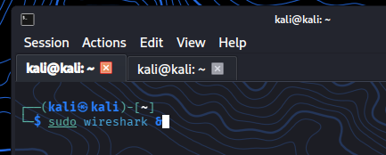
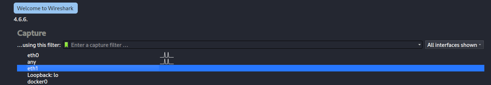
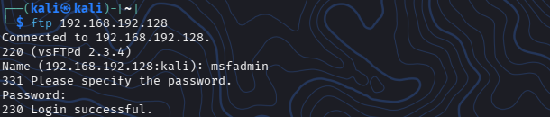
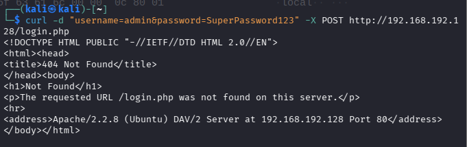
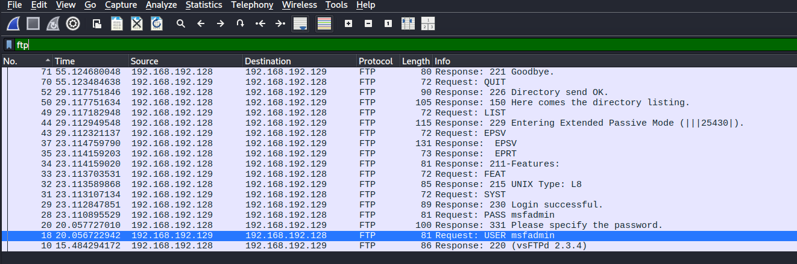
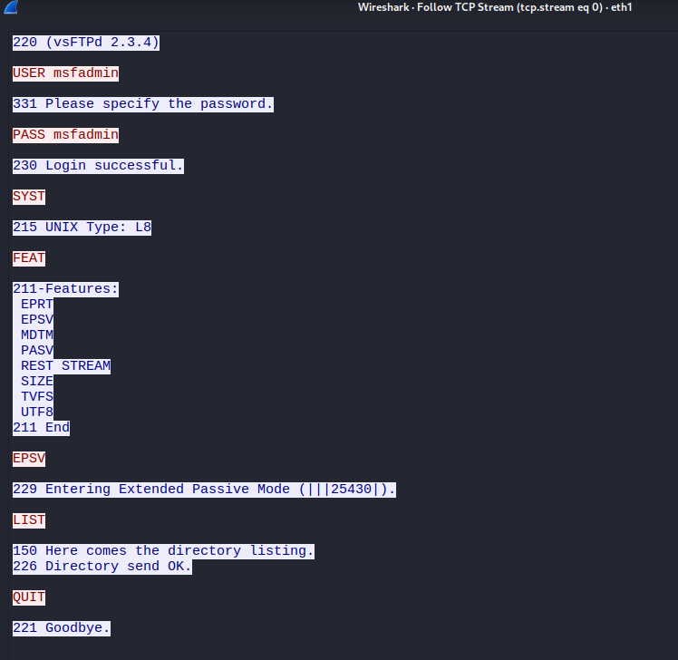
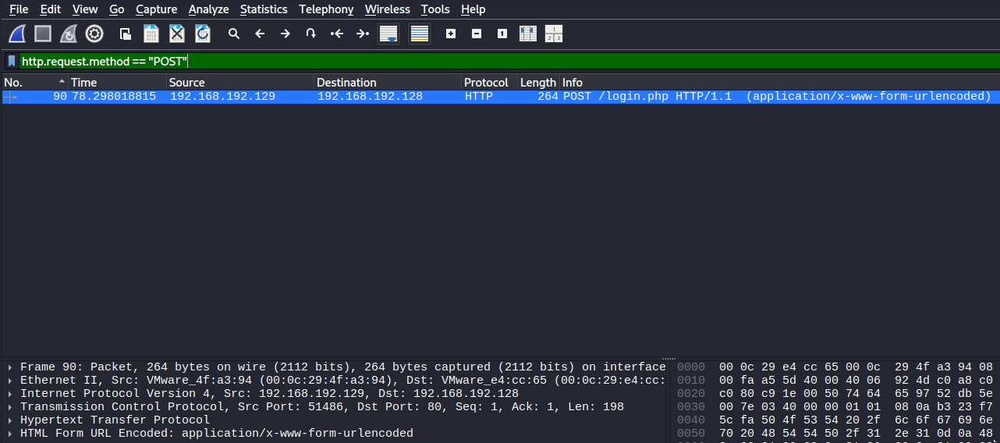
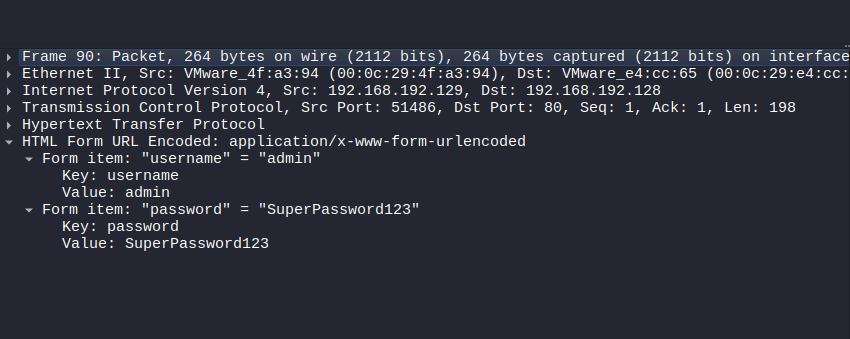

# 04. Captura de Tráfico con Wireshark

## Características

**Nivel:** 1 - Sencillo

**Entorno:** VMware

**Máquina Atacante:** Kali Linux

**Máquina Objetivo:** Metasploitable2

**IP Objetivo:** `192.168.192.128`

---

## 🎯 Objetivos

- Analizar el tráfico de red en tiempo real durante interacciones con servicios no cifrados
-  Aplicar filltros de visualización específicos en Wireshark (`ftp`, `http.request.method`)
- Etraer credenciales transmitidas en texto plano mediante la inspección de flujos TCP (`TCP Stream`)


---

## Captura de Tráfico con Wireshark

En este laboratorio vamos a pasar de la persepctiva del atacante a la del **Analista de Seguridad/Blue Team**

Utilizaremos **Wireshark** en Kali Linux para capturar llos paquetes de red mientras interactuamos con **Metasploitable2**, demostrando en la práctica por qué los protocolos que no usan cifrado (como FTP, HTTP o Telnet) exponen credenciales en texto plano a cualquiera que esté escuchando el tráfico


## Iniciamos la Captura en Wireshark


### 1. Abriremos la terminal en Kali Linux y lanzamos Wireshark con privilegios elevados

```
sudo wireshark &
```



Al ejecutar el comando anterior en la terminal se abrirá **Wireshark** y se debe seleccionar la interfaz que conecta Kali con la red local de VMware

Solo hacemos doble clic sobre la interfaz para iniciar la captura de paquetes en tiempo real




### 2. Generemos Tráfico e Interacciones


Abriremos una nueva pestaña en la terminal de Kali Linux y realizaremos las siguientes pruebas contra **Metasploitable2**


### Prueba A: Inicio de Sesión por FTP(Texto Plano)

```
ftp 192.168.192.128
```




Una vez dentro, podemos ejecutar algo simple como: **ls** y si queremos salir usamos **quit**


### Prueba B: Petición HTTP/ Formulario Web

Haremos una petición o inicio de sesión en el servicio web HTTP

```
curl -d "username=admin&password=SuperPassword123" -X POST http://192.168.192.128/login.php
```




## Inspeccionar y Filtrar Paquetes en Wireshark

Ahora regresamos a la ventana de **Wireshark**, haremos clic en el boton rojo de Stop y aplicamos los siguientes filtros de visualización en la barra superior


### Filtramos Tráfico FTP

Escribiremos en la barra de filtros lo siguiente y presionamos Enter:

```
ftp
```




Ya localizado, buscamos las filas con la columna info que digan lo siguiente: **Request: User msfadmin** y **Request: PASS msfadmin** y hacemos clic derecho en uno de los paquetes y buscamos FTP>Follow>TCP Stream




### Resultado

Podemos ver que se abre una ventana que nos muestra la conversacion completa entre Kali y Metasploitable2 en texto claro, revelando el usuario y la contraseña sin encrtiptar


### Filtramos HTTP POST

Escribamos en la barra de filtros de Wireshark

```
http.request.method == "POST"
```




¡Perfecto! Ya identificamos el paquete capturado

Ahora despliegamos en el panel inferior la seccion HTML Form URL Encoded




Podemos ver claramente las variables enviadas por la red **(username y password)** expuestas directamente


## 🧠 Lecciones Aprendidas y Remediación

- **Riesgo:** El uso de protocolos legados (HTTP, FTP, Telnet) en redes locales permite ataques de intercepción de tráfico (*Man-in-the-Middle* / *Sniffing*).

- **Remediación (Hardening):**
  - Sustituir FTP por **SFTP** o **FTPS**.
  - Migrar todas las aplicaciones HTTP a **HTTPS** utilizando certificados SSL/TLS.
  - Reemplazar Telnet por **SSH** de forma obligatoria.

- Wireshark es un arma de doble filo, ya que podemos comprender el poder del analizador de tráfico. Para un administrador de redes es una herramienta indispensable de diagnóstico; para un atacante en la red, es el mecanismo perfecto para recolectar información sensible sin dejar rastro


