# 05. Administración Básica de Ubuntu

## Características

**Nivel:** 1 - Sencillo

**Entorno:** VMware

**Sistema Operativo:** Ubuntu Server

**Herramientas Utilizada:** `useradd`, `usermod`, `chmod`, `chown`, `systemctl`, `journarlctl`, ``grep`

---

## Objetivos Técnicos

- Aplicar el **Principio de Menor Privilegio** mediante la creación de usuarios y grupos restringidos

- Configurar permisos de sistema de archivos en notación octal para proteger información sensible

- Gestionar y supervisar el estado de los servicios del sistema operativo

- Auditar registros y logs del sistema para identificar actividades o intentos de accesos no autorizados


---

En este proyeccto pasare al rol de **Administrador de Sistemas/Blue Team**.

Usare la máquina **Ubuntu Server** para practicar:

- tareas fundamentales de hardening
- gestión de usuarios
- asignacción de permisos seguros
- gestión de servicios
- revisión de bitácoras de auditoria


## Preparar la VM Objetivo

 1. Encender la máquina **Ubuntu Server** en VMware

 2. Iniciar sesión en la consola


## Comandos y Prácticas a Ejecutar

Creare un usuario de auditoría sin privilegios de **root** directos y un grupo de seguridad

```
# Crear un grupo de auditoría

sudo groupadd auditores
```
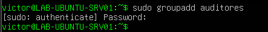


```
# Crear un usuario de auditoría sin shell interactiva de root

sudo useradd -m -s /bin/bash auditor_sec
```
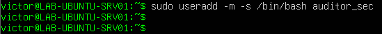

```
# Asignar contraseña al nuevo usuario

sudo passwd auditor_sec
```
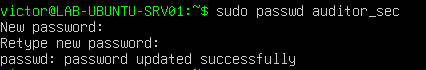

```
# Asignar el usuario al grupo de auditores

sudo usermod -aG auditores auditor_sec
```
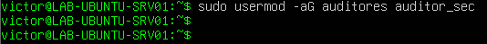


## Gestión de Permisos Especiales y Propietarios (chmod / chown)

Creare un directorio seguro de auditoría y ajustare sus permisos en formato octal

```
# Crear directorio de trabajo

sudo mkdir -p /var/log/auditoria_inter
```
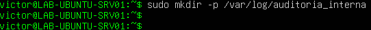

```
# Cambiar propietario y grupo

sudo chown -R root:auditores /var/log/auditoria_interna
```
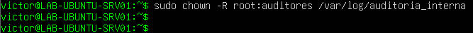

```
# Asignar permisos: 
lectura/escritura/ejecución para root

lectura/ejecución para el grupo

nada para otros

sudo chmod 750 /var/log/auditoria_interna
```
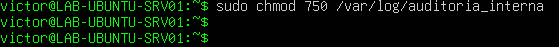

```
# Verificar los permisos aplicados

ls -ld /var/log/auditoria_interna
```
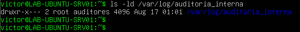


## Control de Servicios del Sistema (systemctl / service)

Inspeccionar, detener o deshabilitar servicios innecesarios o inseguros es algo sumamente importante

```
# Listar servicios en ejecución

systemctl list-units --type=service --state=running
```
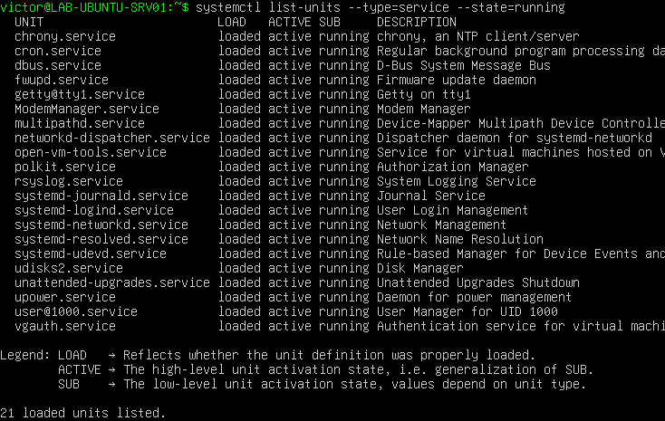

```
# Estado de un servicio específico (ejemplo: SSH o Apache)

sudo systemctl status ssh
```
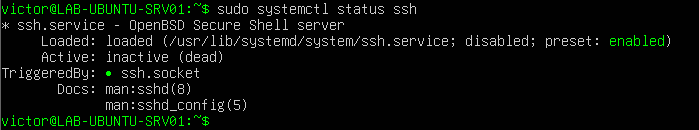

```
# Reiniciar o recargar la configuración de un servicio

sudo systemctl reload ssh
```
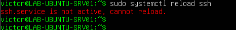


## Inspección de Bitacoras de Sistema y Logs de Auditoría

Analizar intentos de acceso e informacion del sistema de la siguiente manera

```
# Ver eventos recientes del sistema mediante systemd journal

sudo journalctl -n 20 --no-pager
```
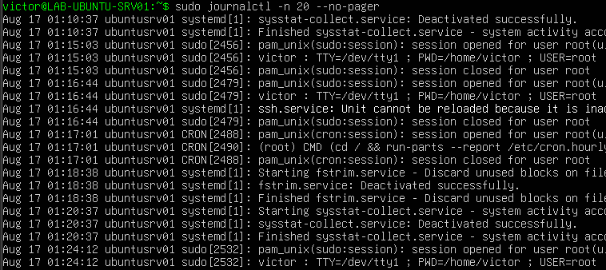

```
# Inspeccionar intentos de autenticacion SSH / Login en Ubuntu

sudo tail -n 20 /var/log/auth.log
```
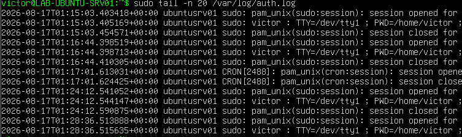

```
# Buscar intentos fallidos de inicio de sesión

sudo grep "Failed password" /var/log/auth.log
```
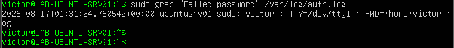


## Lecciones Aprendidas y Remediación

* Riesgo: El uso de permisos laxos (777) o cuentas compartidas con privilegios elevados incrementa exponencialmente el impacto en caso de una intrusión

* Remediación:

- Aplicar siempre la notación de permisos estricta en carpetas críticas

- Revisar periódicamente las cuentas activas en **/etc/passwd** y lor privilegios en **/etc/sudoers**

- Configurar rotación de logs **(lograte)** y monitoreo de autenticaciones fallidas con herramientas como **Fail2ban**


